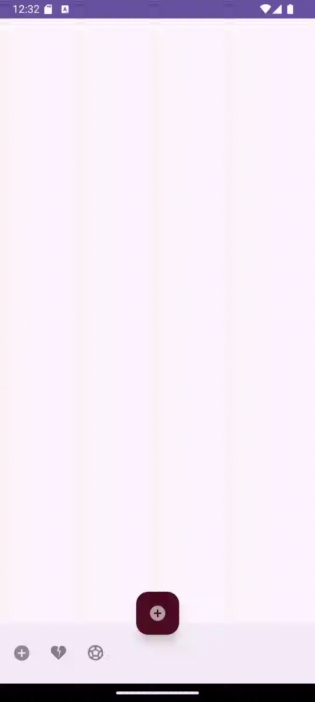

## APP NICESTART
## PRIMERA APP CREADA 

Este repositorio muestra avances en la APP-


Captura de la ***primera pantalla*** :


Captura de la ***segunda pantalla*** :


Esta pantalla contiene ACTION BAR.

Codigo para poner EL ACTION BAR:


Captura de la ***pantalla principal*** :

Cuando doy al boton SIGN UP O CANCEL me lleva a esta pantalla.


Creo otra pantalla para el perfil de la persona: 

-Añado nombre,foto y correo. 


El codigo para añadir foto, ponerla en forma circular es este:


Añado nueva pantalla : ***Splash***

con su animación: 


Codigo para meter un ***tipo a la animacion.***

```       
        TextView texto=findViewById(R.id.titulo);

        ImageView thunder=findViewById(R.id.animacion);
        Animation myanim= AnimationUtils.loadAnimation(this,R.anim.escala);

   
        texto.startAnimation(myanim);
        thunder.startAnimation(myanim);
 ```


Añado el ***Swipe Refresh***


</img>


Añado el  ***menu context*** la OPCION DE PERFIL y el DIALOGO MODAL:
 


</img>


</img>


### *** Button Action Bar***

Implemento menú en el ACTIVITY MAINBAB .
Si hago click al icono de la izquierda se despliega otro menú


</img>

Código del menú que se despliega (sheet_layout):


```<?xml version="1.0" encoding="utf-8"?>
<androidx.constraintlayout.widget.ConstraintLayout xmlns:android="http://schemas.android.com/apk/res/android"
    xmlns:app="http://schemas.android.com/apk/res-auto"
    android:id="@+id/constraintLayoutThis"
    android:layout_width="match_parent"
    android:layout_height="match_parent"
    >


    <!-- Fila 1: Ícono y texto -->
    <ImageView
        android:id="@+id/icono_fila1"
        android:layout_width="32dp"
        android:layout_height="32dp"
        android:layout_margin="8dp"
        android:contentDescription="none"
        android:src="@drawable/settings"
        app:layout_constraintStart_toStartOf="parent"
        app:layout_constraintTop_toTopOf="parent" />

    <TextView
        android:id="@+id/option1"
        android:layout_width="0dp"
        android:layout_height="wrap_content"
        android:layout_margin="8dp"
        android:fontFamily="sans-serif-medium"
        android:text="Settings"

        android:textSize="16sp"
        app:layout_constraintEnd_toEndOf="parent"
        app:layout_constraintStart_toEndOf="@id/icono_fila1"
        app:layout_constraintTop_toTopOf="@id/icono_fila1" />

    <!-- Fila 2: Ícono y texto -->
    <ImageView
        android:id="@+id/icono_fila2"
        android:layout_width="32dp"
        android:layout_height="32dp"
        android:layout_margin="8dp"
        android:contentDescription="none"
        android:src="@drawable/usericon"
        app:layout_constraintStart_toStartOf="parent"
        app:layout_constraintTop_toBottomOf="@id/icono_fila1" />

    <TextView
        android:id="@+id/option2"
        android:layout_width="0dp"
        android:layout_height="wrap_content"
        android:layout_margin="8dp"
        android:fontFamily="sans-serif-medium"
        android:text="About"

        android:textSize="16sp"
        app:layout_constraintEnd_toEndOf="parent"
        app:layout_constraintStart_toEndOf="@id/icono_fila2"
        app:layout_constraintTop_toTopOf="@id/icono_fila2" />

    <!-- Fila 3: Ícono y texto -->
    <ImageView
        android:id="@+id/icono_fila3"
        android:layout_width="32dp"
        android:layout_height="32dp"
        android:layout_margin="8dp"
        android:contentDescription="none"
        android:src="@drawable/keyicon"
        app:layout_constraintStart_toStartOf="parent"
        app:layout_constraintTop_toBottomOf="@id/icono_fila2" />

    <TextView
        android:id="@+id/option3"
        android:layout_width="0dp"
        android:layout_height="wrap_content"
        android:layout_margin="8dp"
        android:fontFamily="sans-serif-medium"
        android:text="Logout"
        android:textSize="16sp"
        app:layout_constraintEnd_toEndOf="parent"
        app:layout_constraintStart_toEndOf="@id/icono_fila3"
        app:layout_constraintTop_toTopOf="@id/icono_fila3" />

        </androidx.constraintlayout.widget.ConstraintLayout>
```


### *** Button Navigation ***

Cada vez que deslizo hacia la derecha o izquierda, navego entre los distintos fragments, al igual que si pulso en los iconos 


</img>

