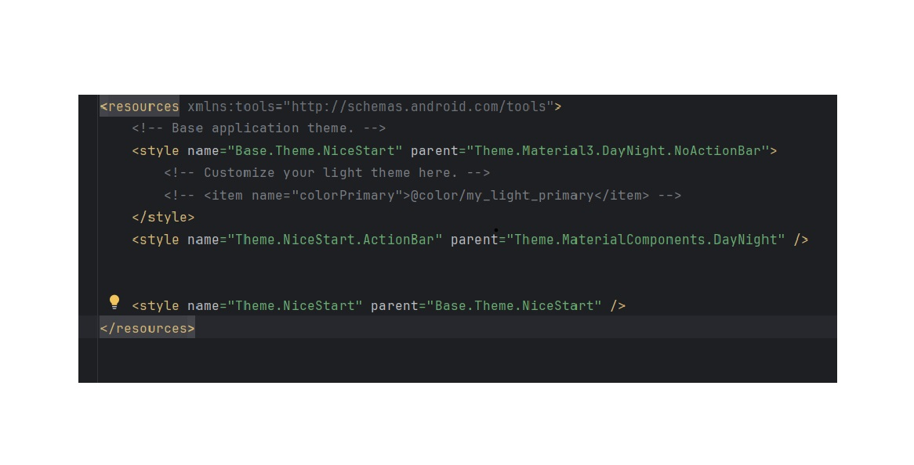

## APP NICESTART
## PRIMERA APP CREADA 

Este repositorio muestra avances en la APP-


Captura de la ***primera pantalla*** :


Captura de la ***segunda pantalla*** :


Esta pantalla contiene ACTION BAR.

Codigo para poner EL ACTION BAR:




Captura de la ***pantalla principal*** :

Cuando doy al boton SIGN UP O CANCEL me lleva a esta pantalla.


Creo otra pantalla para el perfil de la persona: 

-Añado nombre,foto y correo. 


El codigo para añadir foto, ponerla en forma circular es este:


Añado nueva pantalla : ***Splash***

con su animación: 


Codigo para meter un ***tipo a la animacion.***

```       
        TextView texto=findViewById(R.id.titulo);

        ImageView thunder=findViewById(R.id.animacion);
        Animation myanim= AnimationUtils.loadAnimation(this,R.anim.escala);

   
        texto.startAnimation(myanim);
        thunder.startAnimation(myanim);
 ```

Añado el ***Swipe Refresh***
</img>


Añado el  ***menu context*** la OPCION DE PERFIL y el DIALOGO MODAL:
 

</img>


</img>


>This repository is licensed under
>[Creativecommons Org Licenses By Sa 4](http://creativecommons.org/licenses/by-sa/4.0/)